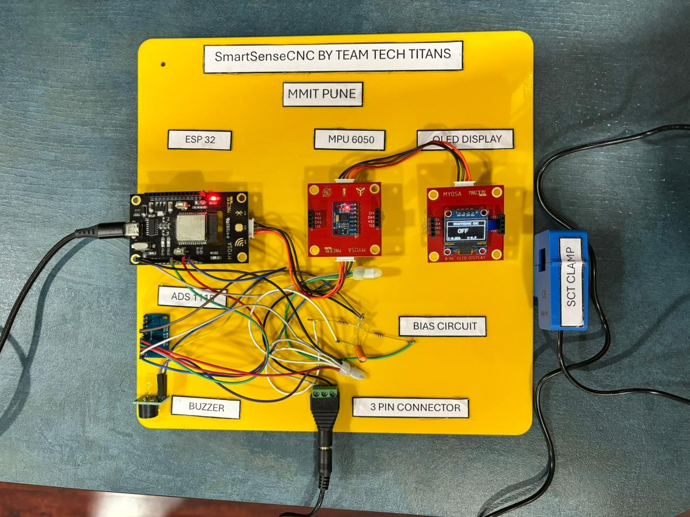

> SmartSenseCNC is a low-cost Industry 4.0 monitoring system that uses embedded sensors, IoT communication, and Machine Learning for intelligent CNC machine-state detection and downtime analysis.

---

## Acknowledgements

This project was developed as part of the MYOSA IoT Innovation Contest focused on Industrial IoT, smart manufacturing, and real-time machine monitoring systems.

Special thanks to:
- Espressif Systems ESP32 developer community
- Open-source Machine Learning ecosystem
- Python and Flask developer communities
- Industrial IoT research resources
- Sensor module documentation contributors

---

## Overview

Modern industries rely heavily on CNC machines for precision manufacturing operations. Unexpected downtime, unnoticed idle states, and inefficient machine utilization can reduce productivity and increase operational costs.

Traditional industrial monitoring systems are often expensive and require complex infrastructure, making them difficult to deploy in small and medium-scale workshops.

SmartSenseCNC was developed as a low-cost Industrial IoT solution capable of monitoring CNC machine operational behavior in real time using embedded sensors and Machine Learning.

The system continuously monitors:
- Current consumption
- Machine vibration activity
- Operational machine states

The project uses:
- ESP32 microcontroller
- SCT-013 current sensor
- MPU6050 vibration sensor
- ADS1115 ADC module
- OLED display
- Buzzer alert system
- Flask backend server
- SQLite database
- Random Forest Machine Learning model

The system classifies machine behavior into:
1. MACHINE OFF
2. MACHINE ON (IDLE)
3. MACHINE ON + WORKING

The project also supports:
- Real-time machine monitoring
- Intelligent machine-state prediction
- Historical data logging
- Downtime analysis
- Dashboard visualization
- Wireless IoT communication

---

## Problem Statement

Industries frequently face operational challenges such as:
- Unplanned machine downtime
- Undetected idle machine states
- Increased electricity consumption
- Manual monitoring dependency
- Delayed operational analysis
- Reduced manufacturing efficiency

Many small and medium-scale workshops cannot afford expensive industrial monitoring systems. As a result, machines are often monitored manually, which increases inefficiency and reduces visibility into actual machine utilization.

SmartSenseCNC addresses these problems by providing:
- Low-cost deployment
- Real-time machine monitoring
- Intelligent operational classification
- Wireless data communication
- Downtime detection and analysis

---

## Objectives

The major objectives of the project are:

- Develop a real-time CNC monitoring system
- Monitor machine behavior using embedded sensors
- Analyze machine operational patterns
- Train Machine Learning models for machine-state classification
- Detect machine operational states accurately
- Build an Industrial IoT monitoring pipeline
- Store historical machine activity
- Reduce downtime visibility gaps
- Demonstrate Industry 4.0 monitoring concepts

---

## Demo / Examples

### Images

<p align="center">
  <br/>
  <i>Complete SmartSenseCNC hardware setup</i>
</p>

<p align="center">
  <br/>
  <i>Machine OFF operational state</i>
</p>

<p align="center">
  <br/>
  <i>Machine ON (IDLE) operational state</i>
</p>

<p align="center">
  <br/>
  <i>Machine ON + WORKING operational state</i>
</p>

### Videos

<video controls width="100%">
  <source src="/assests/videos/smartsensecnc-presentation.mp4" type="video/mp4">
</video>

<video controls width="100%">
  <source src="/assests/videos/smartsensecnc-demo.mp4" type="video/mp4">
</video>

#### Demonstration Video

[](assests/videos/smartsensecnc-demo.mp4)


#### Presentation Video

[](assests/videos/smartsensecnc-presentation.mp4)


## Features (Detailed)

### 1. Real-Time CNC Machine Monitoring

The system continuously monitors CNC machine operational behavior using:
- Current sensing
- Vibration sensing

Sensor readings are collected using ESP32 and transmitted wirelessly to the Flask backend server.

This enables:
- Real-time monitoring
- Continuous operational tracking
- Intelligent machine-state analysis

---

### 2. Machine-State Classification

SmartSenseCNC classifies machine operational behavior into three states.

#### MACHINE OFF
Characteristics:
- Very low current consumption
- Minimal vibration activity
- Machine powered OFF

#### MACHINE ON (IDLE)
Characteristics:
- Current consumption present
- Low vibration activity
- Machine powered ON but not machining

#### MACHINE ON + WORKING
Characteristics:
- Higher current consumption
- Increased vibration activity
- Active machining operation

The Random Forest Machine Learning model predicts machine states using sensor data collected from the prototype system.

---

### 3. Machine Learning Based Prediction

The project uses supervised Machine Learning algorithms for intelligent machine-state prediction.

#### Models Evaluated
- Random Forest
- Decision Tree
- K-Nearest Neighbors (KNN)
- Support Vector Machine (SVM)

#### Model Performance

| Model | Accuracy |
|---|---|
| Decision Tree | 94.17% |
| Random Forest | 93.92% |
| KNN | 91.50% |
| SVM | 87.42% |

Although Decision Tree achieved the highest accuracy, Random Forest was selected for deployment because of:
- Better robustness
- Improved stability
- Reduced overfitting
- Better handling of noisy sensor data

---

### 4. Sensor Data Processing

The system uses RMS-based sensor feature extraction for:
- Noise reduction
- Stable signal processing
- Improved classification accuracy

The following features are processed:
- Current RMS
- Vibration RMS

The ADS1115 ADC module improves analog signal accuracy and stability for current sensing operations.

---

### 5. Real-Time IoT Communication

ESP32 sends processed sensor data to the Flask backend server using HTTP POST communication.

#### Example JSON Data

```json
{
  "machine_id": "CNC-01",
  "vibration": 2.5,
  "current": 0.14
}
```

This supports:
- Wireless monitoring
- Live prediction updates
- Real-time dashboard integration

---

### 6. Historical Data Logging

All machine activity and prediction results are stored in an SQLite database.

Stored information includes:
- Machine ID
- Current readings
- Vibration readings
- Predicted machine state
- Timestamp

This supports:
- Historical analysis
- Operational tracking
- Downtime monitoring

---

### 7. Dashboard Monitoring System

The dashboard provides:
- Live machine-state display
- Real-time sensor readings
- Historical machine logs
- Operational activity tracking
- Downtime analysis

The dashboard communicates with the Flask backend using API requests.

---

### 8. Alert System

The project uses:
- OLED display
- Buzzer alerts

The system provides immediate notification during:
- Machine-state changes
- Extended idle conditions
- Operational transitions

---

## Dataset Description

The dataset used in this project contains machine operational data collected from the prototype system and expanded using controlled synthetic augmentation methods.

The dataset contains:
- Current sensor readings
- Vibration sensor readings
- Machine operational states

### Dataset Features

| Feature | Description |
|---|---|
| machine_id | CNC machine identifier |
| current_rms | RMS current measurement |
| vibration_rms | RMS vibration measurement |
| state | Machine operational state |

### Dataset Characteristics

- Sensor fluctuations
- Operational variability
- Controlled industrial noise
- Overlapping operational regions
- Multiple machine-state conditions

---

## Exploratory Data Analysis (EDA)

Exploratory Data Analysis and Machine Learning experimentation were performed using Google Colab.

EDA was performed to analyze:
- Sensor value distributions
- Machine-state behavior
- Correlation patterns
- Operational variability

### EDA Techniques Used
- Histograms
- Boxplots
- Scatter plots
- Correlation analysis
- Outlier analysis

### Important Findings

- Current and vibration strongly correlate with machine states
- Working states show higher vibration activity
- Idle and working regions contain realistic operational overlap
- Dataset is suitable for ML-based classification

---

## Software Architecture

The SmartSenseCNC system is divided into multiple modules responsible for:
- Sensor data collection
- Machine Learning prediction
- Database logging
- Dashboard visualization
- API communication

### System Workflow

```plaintext
MPU6050 + SCT-013 → ADS1115 → ESP32 → Flask Backend → Random Forest Model → SQLite Database → Dashboard + Alerts
```

---

## Usage Instructions

### Step 1 — Hardware Setup

Connect:
- SCT-013 current sensor to ADS1115 analog input
- ADS1115 SDA and SCL pins to ESP32 I2C pins
- MPU6050 vibration sensor to ESP32 I2C pins
- OLED display and buzzer to ESP32 GPIO pins

### ADS1115 Connections

| ADS1115 Pin | ESP32 Pin |
|---|---|
| VCC | 3.3V |
| GND | GND |
| SDA | SDA |
| SCL | SCL |

### SCT-013 Bias Circuit and ADS1115 Connections

The SCT-013 current sensor output is passed through a biasing and signal-conditioning circuit before connecting to the ADS1115 ADC module.

### Bias Circuit Components
- 2 × 100kΩ resistors
- 1 × 10µF capacitor

The bias circuit is used for:
- AC signal stabilization
- Midpoint voltage biasing
- Noise reduction
- Improved ADC reading accuracy

### SCT-013 to ADS1115 Connections

| SCT-013 Circuit Output | ADS1115 |
|---|---|
| Signal Output | A0 |
| GND | GND |

The ADS1115 module improves analog signal accuracy and provides more stable current measurements compared to the internal ESP32 ADC.

Power the system using:
- USB
OR
- External battery setup

---

### Step 2 — Install Python Dependencies

```bash
pip install -r requirements.txt
```

---

### Step 3 — Run Flask Backend

```bash
python backend/app.py
```

The server runs on:

```plaintext
http://0.0.0.0:5000
```

---

### Step 4 — Upload ESP32 Firmware

Upload:

```plaintext
firmware/esp32_monitoring.ino
```

using Arduino IDE.

---

### Step 5 — Connect ESP32

ESP32 sends sensor data to:

```plaintext
http://<YOUR_IP>:5000/predict
```

Ensure:
- ESP32
- Laptop

are connected to the same Wi-Fi network.

---

### Step 6 — Open Dashboard

Open browser:

```plaintext
http://localhost:5000
```

Dashboard displays:
- Live machine state
- Sensor activity
- Historical logs

---

## Tech Stack

### Hardware
- ESP32
- MPU6050
- SCT-013
- ADS1115
- OLED Display
- Buzzer
- Biase Circuit

### Programming Languages
- Python
- C++
- HTML
- CSS
- JavaScript

### Backend
- Flask
- SQLite

### Machine Learning
- Scikit-learn
- Random Forest
- Decision Tree
- KNN
- SVM

### Data Analysis
- Pandas
- NumPy
- Matplotlib
- Seaborn

### Development Platforms
- Google Colab
- VS Code
- Arduino IDE

---

## Requirements / Installation

Install all required dependencies:

```bash
pip install -r requirements.txt
```

### requirements.txt

```plaintext
flask
pandas
numpy
scikit-learn
joblib
pyserial
matplotlib
seaborn
```

---

## File Structure

```plaintext
SmartSenseCNC/
│
├── .gitignore
├── README.md
├── requirements.txt
│
├── assests
│   ├── images
│   │       hardware-setup.jpeg
│   │       machine-state-off.jpeg
│   │       machine-state-on-idle.jpeg
│   │       machine-state-on-working.jpeg
│   │
│   └── videos
│           smartsensecnc-demo.mp4
│           smartsensecnc-presentation.mp4        
│
├── backend
│       app.py
│       generate_data.py
│       read_serial.py
│       smartsensecnc.db
│
├── dashboard
│       dashboard.html
│
├── dataset
│       cnc-dataset.csv
│
├── docs
│       smartsensecnc-execution-plan.pdf
│       smartsensecnc-presentation.pdf
│       smartsensecnc-proposal.pdf
│
├── firmware
│       esp32_monitoring.ino
│
└── ml-model
        eda-cnc-dataset.pdf
        model.pkl
```

---

## Results

The project successfully achieved:
- Real-time CNC monitoring
- Machine-state prediction
- Wireless IoT communication
- Historical data logging
- Dashboard visualization
- Downtime analysis

### Final Accuracy Results

| Model | Accuracy |
|---|---|
| Decision Tree | 94.17% |
| Random Forest | 93.92% |
| KNN | 91.50% |
| SVM | 87.42% |

---

## Future Improvements

Future enhancements planned:
- Cloud dashboard integration
- MQTT communication
- Predictive fault analysis
- Multi-machine deployment
- Mobile application support
- Edge AI optimization
- Advanced industrial analytics

---

## Industrial Applications

SmartSenseCNC can be used in:
- Manufacturing industries
- CNC workshops
- Smart factories
- Industrial automation systems
- Predictive maintenance monitoring
- Production monitoring systems

---

## Conclusion

SmartSenseCNC demonstrates the integration of:
- Industrial IoT
- Embedded Systems
- Sensor Networks
- Machine Learning
- Real-time monitoring technologies

The system provides a low-cost and intelligent solution for CNC machine monitoring and operational state analysis using embedded sensors, IoT communication, and Machine Learning.

The project successfully classifies CNC machine operational states in real time while supporting wireless monitoring, historical analysis, and downtime tracking.

SmartSenseCNC demonstrates practical Industry 4.0 concepts suitable for smart manufacturing and intelligent industrial monitoring applications.

---

## License

This project is intended for educational, research, and demonstration purposes.

---

## Contribution Notes

Contributions are welcome for:
- Dashboard improvements
- Sensor calibration optimization
- Advanced ML models
- Cloud deployment
- Edge AI enhancement
- Multi-machine scalability

Researchers and developers can extend the project by improving Industrial IoT integration and machine analytics capabilities.
